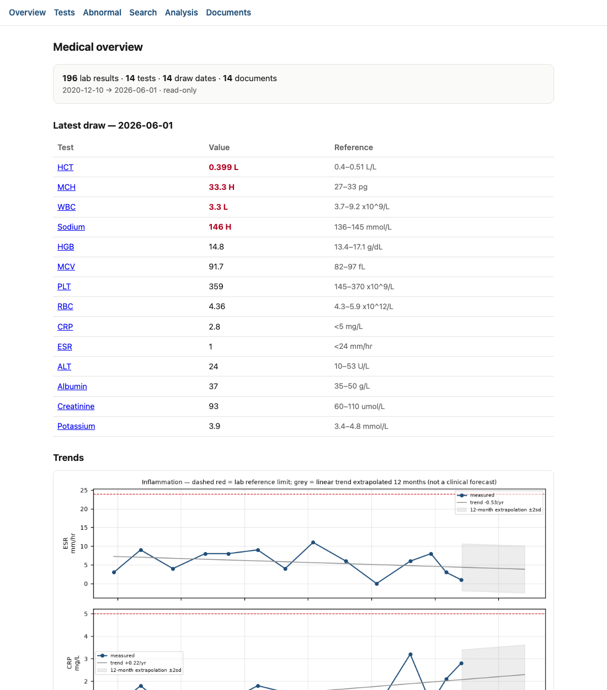
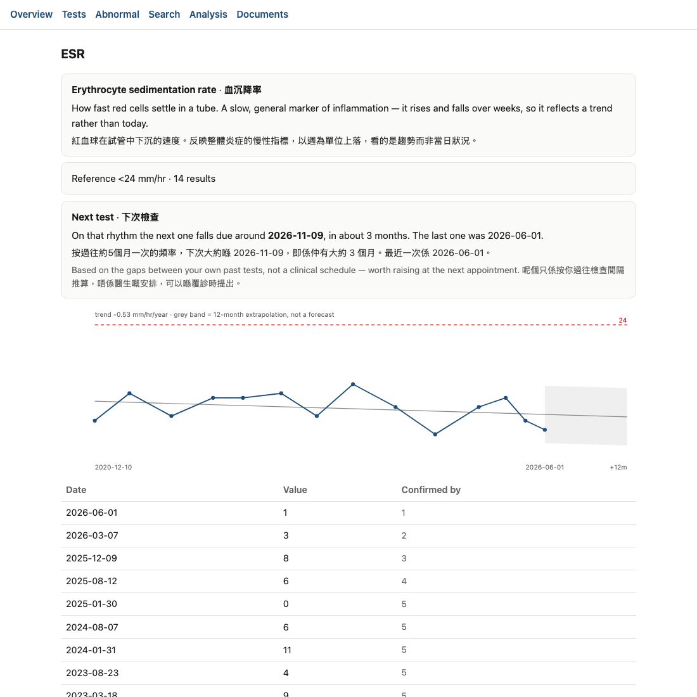

<p align="center">
  
  &nbsp;&nbsp;
  
</p>

<h1 align="center">hago-scraper</h1>

<p align="center">
  Get your own Hong Kong Hospital Authority medical records off your phone —
  then actually query them.<br>
  <sub>Export · parse · SQLite · local semantic search · private web UI</sub>
</p>

<p align="center">
  <a href="#quick-start">Quick start</a> ·
  <a href="SECURITY.md">Security</a> ·
  <a href="ANDROID.md">Android</a> ·
  <a href="AGENTS.md">AI agents</a> ·
  <a href="#limitations--what-this-does-not-capture">Limitations</a>
</p>

<p align="center">
  
  
</p>
<p align="center"><sub>Screenshots use generated sample data
(<code>demo/make_demo_db.py</code>) — no real records.</sub></p>

---

## Quick start

Ten minutes, assuming the phone side is already paired.

```bash
# 1. install
git clone https://github.com/<you>/hago-scraper.git && cd hago-scraper
brew install poppler && pip3 install numpy scipy matplotlib

# 2. configure — nothing identifying ever lives in the repo
cp .env.example ~/.hago-scraper.env && chmod 600 ~/.hago-scraper.env
$EDITOR ~/.hago-scraper.env          # set HAGO_DIR, MEDICAL_DB, DOB_YEAR

# 3. check before you start
python3 check_setup.py               # tells you exactly what is missing

# 4. export from the phone (log into the app by hand first)
./phone/sweep_year.sh 2024

# 5. name, file, and build
python3 parse/organise_hago.py "$INCOMING_DIR"           # dry run
python3 parse/organise_hago.py "$INCOMING_DIR" --apply
python3 analyse/build_db.py

# 6. read it
python3 analyse/query.py lab ESR
python3 analyse/serve.py             # private web UI
```

**Already have the PDFs?** Skip step 4 — everything from step 5 works on any
folder of HA lab reports, on any OS with `pdftotext`.

**Just want to look around first?** Build a synthetic database and browse it,
no medical data required:

```bash
python3 demo/make_demo_db.py
MEDICAL_DB=demo/demo.db MEDICAL_OUT=/tmp/demo BIND_MODE=localhost python3 analyse/serve.py
```

---

Get your own Hong Kong Hospital Authority medical records off your iPhone, and
turn the PDFs into data you can actually query.

HA GO and 醫健通 (eHealth) will *show* you your records but offer no bulk export
and no API. This drives the apps through iPhone Mirroring, saves each report as
a PDF, then names, parses, stores and searches them.

**Nothing in this repository is medical data.** The code holds no name, no ID,
no diagnosis. Everything identifying comes from a config file you create
yourself and never commit.

## Works with

| App | Publisher | iOS | Android |
|---|---|---|---|
| **HA Go** | Hong Kong Hospital Authority | [App Store](https://apps.apple.com/hk/app/ha-go/id1489096699) | [`hk.org.ha.hago`](https://play.google.com/store/apps/details?id=hk.org.ha.hago) |
| **醫健通 eHealth** | eHealth, HKSAR Government | [App Store](https://apps.apple.com/hk/app/%E9%86%AB%E5%81%A5%E9%80%9Aehealth/id1514742468) | [Google Play](https://play.google.com/store/apps/details?id=hk.gov.ehealth.ehr) |

> **Not affiliated with, endorsed by, or connected to the Hospital Authority or
> the HKSAR Government.** "HA Go" and "醫健通 / eHealth" are their marks, used
> here only to say which apps this tool reads. It automates a person's own
> account to get their own records out, and does nothing a user could not do by
> tapping through the apps themselves.

---

## Read this before you start

- **These are your medical records.** Treat the output directory the way you'd
  treat a passport scan. See [SECURITY.md](SECURITY.md) — it is short and it is
  the most important file here.
- **The parser produces a subset, not a transcript.** It reads what it
  recognises and stays quiet about what it doesn't. Never use it as your only
  copy of anything, and keep the source PDFs.
- **This is not a medical device and not a second opinion.** It counts and plots
  numbers you already had. Every clinical decision stays with your doctor.
- **You are automating your own account, with your own credentials, against your
  own records.** That is the only use this is written for.

---

## Prerequisites

| Requirement | Why | Check |
|---|---|---|
| macOS Sequoia or later, on the Mac paired to your iPhone | iPhone Mirroring only exists here | `sw_vers` |
| iPhone Mirroring, already paired | pairing needs the physical phone once | open the app |
| [phone-harness](https://github.com/ShawnPana/phone-harness) | screen capture + tap/type control | `phone-harness --doctor` |
| Python 3.9+ | everything | `python3 -V` |
| poppler (`pdftotext`) | reads the PDF tables | `brew install poppler` |
| numpy | vector search, statistics | `pip3 install numpy` |
| scipy | trend tests (optional; only `stats_tests.py`) | `pip3 install scipy` |
| matplotlib | charts (optional; skipped if missing) | `pip3 install matplotlib` |
| [Ollama](https://ollama.com) + `nomic-embed-text` | local embeddings for semantic search (optional) | `ollama pull nomic-embed-text` |
| Tailscale, or a tunnel | only if you want the web UI off this machine | `tailscale status` |

Two macOS permissions must be granted **to the terminal you run this from**,
under System Settings → Privacy & Security:

- **Accessibility** — taps and keystrokes. Takes effect immediately.
- **Screen Recording** — seeing the phone. Takes effect after you restart the
  terminal app.

> Run it from a plain terminal or over plain `ssh`. A **tmux** server started
> from ssh does *not* inherit Screen Recording, and every capture fails with a
> misleading `cannot read image` error.

Run the preflight check before anything else:

```bash
python3 check_setup.py
```

---

## Install

```bash
git clone git@github.com:<you>/hago-scraper.git
cd hago-scraper
brew install poppler
pip3 install numpy scipy matplotlib
cp .env.example ~/.hago-scraper.env
chmod 600 ~/.hago-scraper.env
$EDITOR ~/.hago-scraper.env
```

---

## Where to keep your records

**Not in this repository.** Put them somewhere outside the checkout and lock the
permissions down:

```bash
mkdir -p ~/records && chmod 700 ~/records
```

Then point the config at it:

```bash
export HAGO_DIR="$HOME/records"          # renamed PDFs live here
export INCOMING_DIR="$HOME/incoming"     # fresh exports land here first
export MEDICAL_DB="$HOME/records/medical.db"
```

`.gitignore` blocks `*.pdf`, `*.db`, `*.csv` and the record directories as a
backstop, but do not rely on it — keep the data out of the tree entirely.

**iCloud is a pipe, not a home.** The phone can only hand files over through
iCloud Drive (AirDrop fails reliably between the phone and a Mac on the same
Apple ID). Move the files to local storage and delete the iCloud copy as soon as
they land. Don't leave records sitting in someone else's cloud.

---

## Configure

Everything identifying comes from `~/.hago-scraper.env`, which the sweep drivers
source automatically:

```bash
export HA_ACCOUNT_NAME="你的名字"   # your name as the app shows it, filtered out of OCR rows
export DOB_YEAR=1990                # so a date of birth is never read as a collect date
export HAGO_DIR="$HOME/records"
export INCOMING_DIR="$HOME/incoming"
export MEDICAL_DB="$HOME/records/medical.db"
export OLLAMA="http://localhost:11434"
```

`HA_ACCOUNT_NAME` matters: your name is printed in the app header and OCRs as if
it were a table row. Without it, the sweeper may try to "open" your own name.

---

## Run it

**1 — Export from the phone.** Log into the app by hand first; biometric login
cannot work over mirroring, because your face isn't at the phone.

```bash
./phone/sweep_year.sh 2024          # retries until the year comes back dry twice
YEAR=2024 phone-harness < phone/lab_sweep.py    # or a single pass
./phone/sweep_rad_year.sh 2024      # radiology
```

**Only ever run one sweep at a time.** Two fight over the same phone and fail
with errors that look like app faults and aren't.

**2 — Name and file the exports.**

```bash
python3 parse/organise_hago.py "$INCOMING_DIR"            # dry run, prints the plan
python3 parse/organise_hago.py "$INCOMING_DIR" --apply    # move + rename
```

**3 — Build, embed, analyse.**

```bash
python3 analyse/build_db.py     # -> $MEDICAL_DB
python3 analyse/embed_db.py     # local embeddings (needs Ollama)
python3 analyse/analyse.py      # -> analysis.md + charts/
```

**4 — Read it.**

```bash
python3 analyse/query.py ask   "gut inflammation"   # semantic
python3 analyse/query.py find  "calprotectin"       # exact keyword
python3 analyse/query.py lab   ESR                  # one test over time
python3 analyse/query.py flags                      # everything out of range
python3 analyse/serve.py                            # web UI — see "Serving it" below
```

### Serving it somewhere

Where it listens is an explicit choice, not a guess:

```bash
BIND_MODE=tailscale python3 analyse/serve.py    # default: your tailnet only
BIND_MODE=localhost python3 analyse/serve.py    # behind a Cloudflare/SSH tunnel or proxy
BIND_MODE=lan       python3 analyse/serve.py    # your LAN — everyone on it can reach it
BIND=192.168.1.20   python3 analyse/serve.py    # an explicit address
```

It refuses to start rather than binding somewhere wider than you asked for.
`BIND_MODE=any` additionally requires `ALLOW_ANY_INTERFACE=1`.

Exposing it beyond your own machine? Set a token — a Cloudflare Tunnel gives you
TLS but authenticates nobody:

```bash
export AUTH_TOKEN=$(python3 -c "import secrets;print(secrets.token_urlsafe(32))")
export BEHIND_TLS=1        # marks the auth cookie Secure
BIND_MODE=localhost python3 analyse/serve.py
cloudflared tunnel --url http://127.0.0.1:8137
```

Then open `https://…/?token=<token>` once; it moves into a cookie.

---

## Security

Full detail in [SECURITY.md](SECURITY.md). The short version:

- Records live outside the repo, `chmod 700` directory, `chmod 600` files. The
  pipeline sets `600` on everything it generates.
- `serve.py` listens where `BIND_MODE` says and **refuses to start** rather than
  falling back to something wider. Default is your tailnet only. Behind a tunnel
  use `localhost` plus `AUTH_TOKEN` — a Cloudflare Tunnel provides TLS, not
  authentication.
- Embeddings are generated **locally** by Ollama. No record text is sent to a
  hosted API.
- **Never paste records into a cloud model**, and be careful reviewing this code
  with one: check for diagnoses and drug names, not just names and ID numbers.
- Delete the iCloud copies once files are local.

---

## Things that will bite you

- **Never match a Chinese label exactly.** The row parser keyed on 「醫院」 and
  Vision garbles 醫 constantly — 盤院, 馨院, 髷院, 齧院. Mis-read rows were
  invisible, so the sweeper declared each year finished early and silently
  skipped **37 records**. Match 「院」 and validate structurally.
- **Never run two sweeps at once.** Symptoms are `cannot read image window.png`
  and `cannot select year`, which look like mirroring problems and are not.
- **Never mark a failed export as done.** Ledgering a failure retires that
  record forever. Failures belong in a separate file with a retry cap.
- **Never run the organiser on its own destination.** It would see every file as
  a duplicate of itself and delete the lot. It now refuses; keep it that way.
- **Sessions expire every few hours**, and biometric login can't work over
  mirroring. Expect to log in by hand and plan the work in one sitting.
- **Lab sheets are cumulative** — one report repeats up to five previous collect
  dates. Exports overlap heavily, so deduplicate on **content**, never filename.
- **Parse by word coordinates, not whitespace.** `pdftotext -bbox-layout` and
  nearest-column matching; `-layout` shifts every value one column left the
  moment a cell is blank.
- **Group rows per page.** A second panel restarts its y coordinates and will
  splice into the first if you don't.
- **Drop the prose.** Interpretive footnotes ("Plasma glucose concentration
  <2.5 or >= 11.1 mmol/L") and the lipid "Desirable levels" tables both parse as
  results if you let them.

---

## Limitations — what this does *not* capture

Know these before you trust a number:

- **One value per (date, test).** Two draws on the same day can't both be
  stored; the second is dropped with a warning.
- **Unusual result formats are skipped**: titres (`1:80`), scientific notation,
  negative numbers, free text like `No growth`.
- **Censored values** (`<0.6`) are stored as the bound with a `comparator`
  field. They are **upper bounds**, not measurements — don't trend them.
- **Single-date sheets carry no reference range**, so a value seen only there
  will have a blank range.
- Reference ranges attach from the newest report carrying the value, chosen by
  filename order, which is not strictly chronological.
- Radiology images are not downloaded — reports only.

---

## Troubleshooting

| Symptom | Cause |
|---|---|
| `cannot read image window.png` | mirroring dropped, or you're under tmux without Screen Recording. Quit and reopen iPhone Mirroring |
| `cannot select year` | usually a second sweep running, or a pending 確認 modal swallowing taps |
| Taps do nothing, state says `ready` | the mirroring session died silently. Restart iPhone Mirroring |
| `iPhone in Use` | you're holding the phone. Lock it |
| Sweep finishes suspiciously fast | a row parser matching a garbled label — check the 院 note above |
| `no embeddings for <model>` | run `embed_db.py`, or you changed model and must re-embed |
| `refusing to publish` from `build_db.py` | the new build has far fewer rows than the old one. Investigate before forcing |

---

## Android

Not built, but likely easier than iOS — `uiautomator dump` gives the real view
hierarchy, so the OCR problems disappear entirely, and `adb pull` gets files off
without any cloud involved. Two things need checking first. See
[ANDROID.md](ANDROID.md).

## Driving it with an AI agent

Claude Code or Codex can run the whole pipeline. Only the phone-export step
needs anything installed (phone-harness); parsing and analysis need nothing
special. Rules and pitfalls: [AGENTS.md](AGENTS.md).

## Licence

MIT — see [LICENSE](LICENSE).
